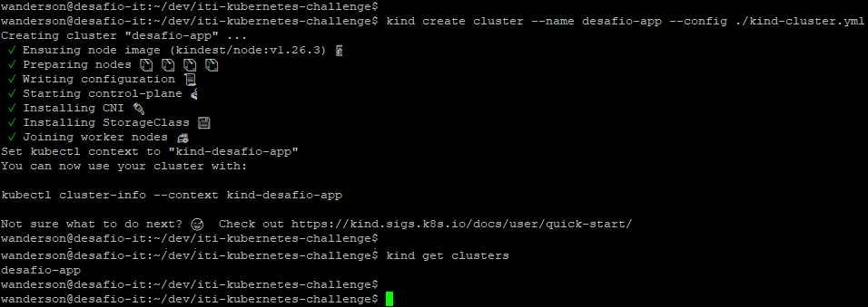

# Challenge - Kubernetes

## Sobre o Desafio: 

Esse é um teste feito para conhecer um pouco mais de cada candidato. 
Não é um teste objetivo e não há apenas uma solução que consideramos correta. 
O intuito é ser um estudo de caso com o propósito de conhecer o seu modo de trabalhar.

## Introdução

Temos neste repositório uma aplicação em Kotlin simples com uma API REST que responde um Hello World quando recebe um GET na porta 8080. (ex: curl http://localhost:8080/)

* Containerize essa aplicação
* Crie um Helm chart contendo os manifestos necessários para essa aplicação rodar em um cluster Kubernetes local (use minikube ou kind para fazer o spin-up desse cluster local)
* Utilizando Terraform, realize o deploy da app no cluster.

## Algumas dicas que podem ser importantes:

* Invista tempo em escrever uma documentacão de qualidade
* Empregue quaisquer boas práticas que achar conveniente 
* Organize seu código
* Seja eficiente e simples
* Uso de módulos no terraform será considerado um plus

## Entrega do desafio:

Clone esse repositório e realize todas as modificações, depois que terminar, compacte o repositorio e nos envie. 
Mantenha o .git no arquivo compactado, queremos analisar os seus commits.
**Versão do Gradle: 4.10**

---

## **Pré-requisitos**

Pré-requisitos necessário para execução do desafio:
 Git - Terraform / tfenv - docker - Kind - Kubectl - java-17-openjdk - Gradle 4.10 - kotlin - Helm -  Metrics Server / Para auto scale

---

## **1. Instalação Requisitos**
<details>
<summary>GIT</summary>

1. Comando para instalação:
   ```bash
   sudo dnf install git -y
   ```
2. Validação:
   ```bash
   git --version
   ```
</details>
<details>
<summary>TFENV</summary>

1. Comando para instalação:
   ```bash
   Baixando o Tfenv:
   git clone https://github.com/tfutils/tfenv.git ~/.tfenv
   ```
2. Configuramdp:
   ```bash
   Adicionando a variavel de ambiente no bash_profile para poder chamar de qualquer diretório:
   echo 'export PATH="$HOME/.tfenv/bin:$PATH"' >> ~/.bash_profile
   ```
3. Auternativa para configurar:
   ```bash
   Auternativa ao bash profile:
   sudo ln -s ~/.tfenv/bin/* /usr/local/bin
   ```
4. Comando para validação:
   ```bash
   tfenv -v
   ```
5. Instalando o Terraform:
   ```bash
    Para instalar o terraform digite:
    tfenv install 1.8.3
    Aguarde concluir o download ai digite:
    tfenv use 1.8.3  
   ```
</details>
<details>
<summary>DOCKER</summary>

1. Adicione o repositório do Docker:
   ```bash
   sudo dnf config-manager --add-repo https://download.docker.com/linux/centos/docker-ce.repo
   ```
2. Com o repositório adicionado, instale o Docker, que é composto de três pacotes::
   ```bash
   sudo dnf install docker-ce docker-ce-cli containerd.io -y 
   ```
3. Após a conclusão da instalação, inicie o daemon do Docker e coloque na inicilização automatica::
   ```bash
   sudo systemctl start docker
   sudo systemctl enable docker
   sudo systemctl status docker
   ```
4. Executando o comando Docker sem Sudo (opcional):
   ```bash 
   Executando o comando Docker sem Sudo (opcional)
   Se você quiser evitar digitar sudo sempre que executar o comando docker, adicione seu nome de usuário ao grupo docker:
   sudo usermod -aG docker $(whoami)

   Se você precisar adicionar um usuário ao dockergrupo no qual não está logado, declare esse nome de usuário explicitamente usando:
   sudo usermod -aG docker nome_de_usuário_aqui
   ```
5. Ativando usuario sem root:
   ```bash
   OBS: Após a ação acime e necessario reiniciar o terminal.
   ```
</details>
<details>
<summary>KIND</summary>

1. Baixando o kind:
   ```bash
   [ $(uname -m) = x86_64 ] && curl -Lo ./kind https://kind.sigs.k8s.io/dl/v0.27.0/kind-linux-amd64
   ```
2. Transformando o binario em executavel:
   ```bash
   chmod +x ./kind
   ```
3. Configurando o kind para responder com o usuário em quaquer diretório:
   ```bash
   sudo mv ./kind /usr/local/bin/kind 
   ou
   sudo ln -s ~/kind /usr/local/bin/kind
   ```
4. Para validar e verificar a versão:
   ```bash
   kind --versiono
   ```
</details>
<details>
<summary>KUBECTL</summary>

1. Baixando o kubectl:
   ```bash
   curl -LO "https://dl.k8s.io/release/$(curl -L -s https://dl.k8s.io/release/stable.txt)/bin/linux/amd64/kubectl"
   ```
2. Transformando o binario em executavel:
   ```bash
   chmod +x kubectl
   ```
3. Configurando o kubectl para responder com o usuário em quaquer diretório:
   ```bash
   sudo mv ./kubectl /usr/local/bin/kubectl
   ou
   sudo ln -s ~/kubectl /usr/local/bin/kubectl
   ```
4. Para validar e verificar a versão:
   ```bash
   kubectl version --output=yaml
   ```
</details>
<details>
<summary>JAVA</summary>

1. Para instalar o JDK , execute o seguinte comando:
   ```bash
   sudo apt-get install openjdk-17-jdk
   ```
2. Para verificar a instalação, execute o seguinte comando:
   ```bash
   java -version
   ```
3. Configurando o kubectl para responder com o usuário em quaquer diretório:
   ```bash
   sudo mv ./kubectl /usr/local/bin/kubectl
   ou
   sudo ln -s ~/kubectl /usr/local/bin/kubectl
   ```
4. Para validar e verificar a versão:
   ```bash
   kubectl version --output=yaml
   ```
</details>
<details>
<summary>GRADLE</summary>

1. Instalar o Gradle usando SDKMAN! (Recomendado):
   ```bash
   Instalar o SDKMAN!
   curl -s "https://get.sdkman.io" | bash
   ```
2. Após a instalação, execute o seguinte comando para carregar o SDKMAN! no seu shell:
   ```bash
   source "$HOME/.sdkman/bin/sdkman-init.sh"
   ```
3. Agora, instale o Gradle usando o SDKMAN!:
   ```bash
   sdk install gradle 4.10
   OBS: Versão 4.10 foi feito download do site "https://gradle.org/next-steps/?version=4.10&format=all"
   ```
4. Para validar e verificar a versão:
   ```bash
   gradle --version
   ```
</details>
<details>
<summary>KOTLIN</summary>

1. Instalar o Kotlin usando SDKMAN! (Recomendado):
   ```bash
   sdk install kotlin 1.9.10
   ```
2. Após a instalação, execute o seguinte comando para validar a versão:
   ```bash
   kotlin -version
   ```
</details>
<details>
<summary>HELM</summary>

1. Abaixo, segue comando para download do Helm:
   ```bash
   curl -fsSL https://get.helm.sh/helm-v3.16.1-linux-amd64.tar.gz -o helm-linux-amd64.tar.gz
   ```
   2. Extraido pacote
   ```bash
   tar -zxvf helm-linux-amd64.tar.gz
   ```
   3 Movendo par o /usr/local/bin/ para chamar o binario de qualque lugar no servidor.
   ```bash
   sudo mv linux-amd64/helm /usr/local/bin/helm
   ```
   4. Validando a instalação e versão:
   ```bash
   helm version
   ```
</details>
<details>
<summary>Grafahna e prometheus</summary>

1. OBS:
   ```bash
   Ambos serão instalados via receita .
   ```
</details>

---

## **2. Buildando a aplicação**
<details>
<summary>GRADLE</summary>

1. Com o Gradle 4.10 instalado execute:
   ```bash
   Gradle inite - Ira verificar os pacotes e baixar os pendentes.
   Gradle build java application --continue  - Ira buikdar a app dando alguns bypass
   OBS: Provavelmnte será necessarios alguns troubleshooting
   ```
2. Validação:
   ```bash
   Ao concluir acesse o diretório /app/build/libs
   Valide que o arquivo app.jar foi criado.
   ```
</details>

---

## **3. Conteinerizando o app.jar**
<details>
<summary>Docker</summary>

1. Crie o Dockerfile com o cnteúdo abaixo:
   ```bash
   # Use uma imagem base com OpenJDK
   FROM openjdk:17-jdk-slim as build

   # Defina o diretório de trabalho dentro do container
   WORKDIR /app

   # Copie o arquivo JAR para dentro do container
   COPY target/app.jar /app/app.jar

   # Exponha a porta 8080 para o acesso externo
   EXPOSE 8080

   # Comando para rodar a aplicação
   ENTRYPOINT ["java", "-jar", "/app/app.jar"]
   ```
2. Construção da Imagem Docker: 
   ```bash
      No mesmo diretório que se encontra o dockerfile execute:
      docker build -t desafio-app .

      O Comando acima ira executar o dockerfile, e eas ações cotidas nele:
      Fazer o download da imagem: openjdk:17-jdk-slim
      Definir o /app como local de trabalho
      Ira copiar o arquivo que foi buildado "app.jar" para a pasta /app na imagem
      Espoem a porta que a aplicação será executada.
      E executa a app no container.
   ```

3. Testando a imagem: 
   ```bash
   Podemos testar a aplicação localmente executando o seguinte comando:
   docker run -p 8080:8080 desafio-app

   Agora bastar acessar no navegador: http://localhost:8080
   ou no terminal
   curl http://localhost:8080

   Em abos o retorno será o mesmo: Hello Word
   ```
   </details>

---

## **4. Criando o Cluster kubernetes no kind.**
<details>
<summary>Kind</summary>

 1. Criar o Cluster Kubernetes com Kind: 
   ```bash
   Criando um arquivo de configuração para provisionar o cluster com o Control-plane e 3 workers.
   Crie um arquivo .yml com o conteudo abaixo

   kind: Cluster
   apiVersion: kind.x-k8s.io/v1alpha4
   nodes:
     - role: control-plane
     - role: worker
     - role: worker
     - role: worker
   ```

2. Criar o Cluster Kubernetes com Kind: 
   ```bash
   Para chamar o arquivo e provisionar o cluster com 3 worker digite:

   kind create cluster --name desafio-app --config ./kind-cluster.yml
   ```
3. Importando imagem para o cluster:
   ```bash
    Par enviar a imagem para o cluster recem criado digite:
   
   kind load docker-image desafio-iti --name desafio-it

   Agora com nossa imagem pronta, vamos utiliza-la para deployar nossa aplicação.
   ```
</details>

---

## **5. Instalando o Metrics server / HPA autoscaling.**
<details>
<summary>Metrics Server</summary>

 1. Instalando e configurando o Metrics Server. 
   ```bash
   Execute o seguinte comando para instalar o Metrics Server:
   kubectl apply -f https://github.com/wancosta/desafio/blob/main/components.yaml
   ```
2. Com a instalação concluida vamos validar.
   ```bash
   Execute o seguinte comando para verificar se o Metrics Server está funcionando corretamente:
   kubectl get deployment metrics-server -n kube-system
   ```
</details>

---

## **6. Configurando o Helm para o Deploy.**
<details>
<summary>Helm Chart</summary>

 1. Agora, vamos criar um Helm Chart para facilitar o deploy da aplicação no Kubernetes.. 
   ```bash
   Crie um diretório para o Helm Chart:
   mkdir -p Chart/app

   Com o diretório criado execulte:
   helm create Chart

   Dentro desse diretório, veremos uma estrutura padrão criada pelo Helm. 
   Vamos focar principalmente nos arquivos values.yaml e chart.yaml.
   ```
 2. Ajustando o aquivo values.  
   ```bash
Edite o arquivo values.yaml para incluir informações sobre a imagem Docker.
Vamos ajustar para executar na porta correta.
OBS: Esse paraenetro " pullPolicy: IfNotPresent " e muito importe pois devido a ele
conseguimis utilizar a importada ao king sem a necessidade de baixar uma novo. 

   replicaCount: 1

   image:
     repository: meu-desafio
     pullPolicy: IfNotPresent 
     tag: latest

   service:
     type: ClusterIP
     port: 8080

   ingress:
     enabled: false

   resources: {}

   ```
 3. Ajustando o aquivos Chart.  
   ```bash
   No arquivo chart.yaml, vamos garantir que o contêiner use a imagem que acabamos de criar. 
   Certifique-se de que o contêiner é configurado para rodar na porta 8080:

apiVersion: apps/v1
kind: Deployment
metadata:
  name: {{ .Release.Name }}
  labels:
    app.kubernetes.io/name: {{ .Chart.Name }}
    app.kubernetes.io/instance: {{ .Release.Name }}
spec:
  replicas: {{ .Values.replicaCount }}
  selector:
    matchLabels:
      app.kubernetes.io/name: {{ .Chart.Name }}
      app.kubernetes.io/instance: {{ .Release.Name }}
  template:
    metadata:
      labels:
        app.kubernetes.io/name: {{ .Chart.Name }}
        app.kubernetes.io/instance: {{ .Release.Name }}
    spec:
      containers:
        - name: meu-desafio
          image: "{{ .Values.image.repository }}:{{ .Values.image.tag }}"
          imagePullPolicy: {{ .Values.image.pullPolicy }}
          ports:
            - containerPort: 8080
   ```
</details>

---

## **7. Terraform.**
<details>
<summary>Terraform</summary>

 1. Agora vamos criar a receita do terraforma para executar o Helm e depoiar a aplicação. 
   ```bash
   Crie uma pasta terraform mkdir terraform.
   Crie um arquivo main.tf onde iremos configurar nosso provider.
   Conforme abaixo:

   provider "helm" {
     kubernetes {
       config_path    = "~/.kube/config"
       config_context = "kind-desafio-app"
     }
   }

   resource "helm_release" "desafio_app" {
     name       = "desafio-app"
     chart      = "../Chart/app"
     namespace  = "default"

     set {
       name  = "image.repository"
       value = "desafio-app"
     }

     set {
       name  = "image.tag"
       value = "latest"
     }

     set {
       name  = "image.pullPolicy"
       value = "Never"
     }

     set {
       name  = "service.port"
       value = 8080
     }
   }
   ```

 2. Agora seá a reeita do arquivo de variaveis. 
   ```bash
   No diretório terraform crie o arquivo variable.tf

   variable "namespace" {
     default = "desafio-app"
   }

   variable "image_repository" {
     default = "desafio-app"
   }

   variable "image_tag" {
     default = "latest"
   }

   variable "image_pull_policy" {
     default = "Never"
   }

   variable "service_port" {
     default = 8080
   }
   ```
 3. Agora seá a reeita do arquivo de variaveis. 
   ```bash
   Com os arvos criados e no padrão vamos executala-los
   No memso diretório dos arquivos digite:
   terraforma init     -> Ira inicializar o terraform e baixar suads dependencias.
   terraform validate  -> Ira validar se seu codigo esta ok
   terraform fmt       -> Ira identar o código
   terraforma plan     -> Ele ira planeja toda execução e os retorna o que será criado.
   terraform apply     -> Aplica executando a crialção solicitada na receita no nosso caso o deploy da aplicação.
   ```
</details>

## **8. Observabilidade.**
<details>
<summary>Terraform</summary>

 1. Agora vomos instalar o Grafana e o Prometheus. 
   ```bash
   Vamos criar o diretório: mkdir observabilidade.
   Nele vamos criar dois arrquivos com a receita de instalação.
   vim prometheus-values.yaml com o conteudo abaixo:

   server:
     global:
       scrape_interval: 15s

     extraScrapeConfigs:
       - job_name: "desafio-app"
         metrics_path: "/actuator/prometheus"
         static_configs:
           - targets:
               - "desafio-app.default.svc.cluster.local:8080"


   Na sequencia ja crie o arquivo grafana-values.yaml, com o conteudo abaixo:

      adminPassword: admin

   service:
     type: NodePort

   datasources:
     datasources.yaml:
       apiVersion: apps/v1
       datasources:
         - name: Prometheus
           type: prometheus
           url: http://prometheus-server.monitoring.svc.cluster.local
           access: proxy
           isDefault: true

   dashboardProviders:
     dashboardproviders.yaml:
       apiVersion: apps/v1
       providers:
         - name: 'default'
           orgId: 1
           folder: ''
           type: file
           disableDeletion: false
           editable: true
           options:
             path: /var/lib/grafana/dashboards

   dashboards:
     default:
       kubernetes-cluster:
         gnetId: 315
         revision: 1
         datasource: Prometheus
       node-exporter:
         gnetId: 1860
         revision: 1
         datasource: Prometheus
       kubernetes-deployments:
         gnetId: 6417
         revision: 1
         datasource: Prometheus
       kubernetes-pods:
         gnetId: 3131
         revision: 1
         datasource: Prometheus
       sre-burn-rate:
         gnetId: 11074
         revision: 1
         datasource: Prometheus
       sre-latency:
         gnetId: 7587
         revision: 1
   ```

 2. Deployando a Observalidade "Grafana e Prometheus". 
   ```bash
   Agora adicione o repositorio com o comando:
   helm repo add grafana https://grafana.github.io/helm-charts

   Agora atualize suas bibliotecas com o comando:
   helm repo update
  
   Agora, dentro do diretório observabilidade digite:
   helm upgrade --install grafana grafana/grafana -f prometheus-value.yaml
  Aguarde concluir.

   Para validar a instalação grafana digite:
   kubectl get pods -l app=grafana
   ```
  </details>

---

## ** Evidencias**
<details>
<summary>Creando Cluster</summary>
 2. Conforme evidencias abaixo, cluster criado. 
<p align="center">

</p>
